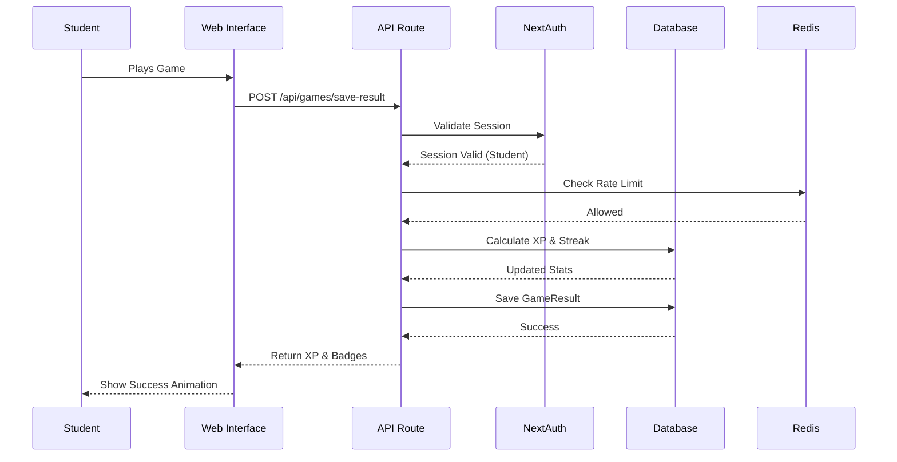

# Data Flow Diagram

This diagram illustrates how data flows through the system during key user interactions, such as a student playing a game.

## Critical Flows

1.  **Authentication**: Secure session creation and validation on every protected request.
2.  **Game Submission**: Validation, rate limiting, XP calculation, and persistence.
3.  **Analytics**: Asynchronous aggregation of data for admin dashboards (cached).
