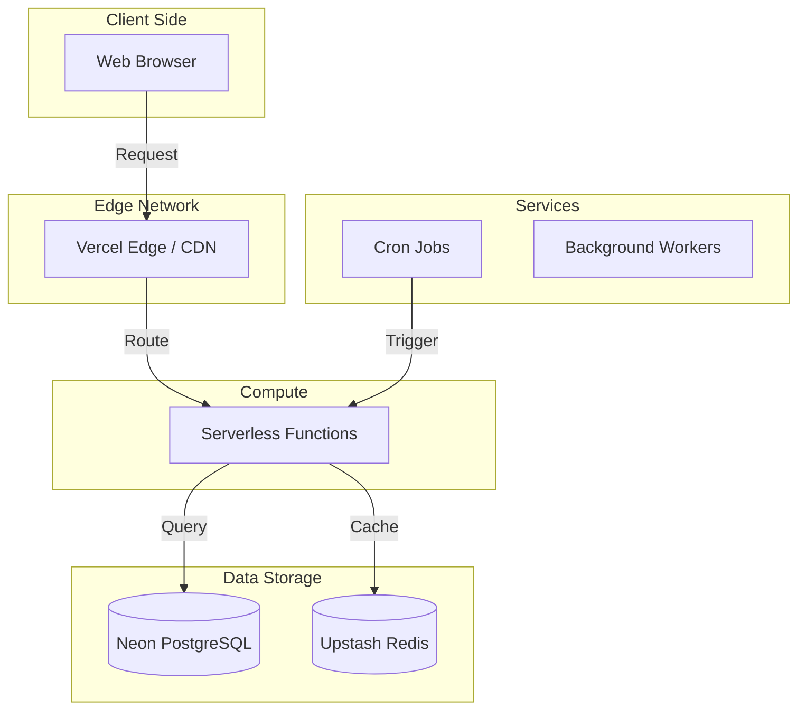

# Deployment Architecture

EduPlay Pro is designed to be deployed on modern PaaS providers like Vercel, Railway, or Render.

## Infrastructure Choices

-   **Hosting**: Agnostic (Railway/Render recommended for full control, Vercel for convenience).
-   **Database**: Neon (Serverless Postgres) for scalability and branching.
-   **Redis**: Upstash (Serverless Redis) for low-maintenance caching.
-   **CI/CD**: GitHub Actions for automated testing and deployment.
